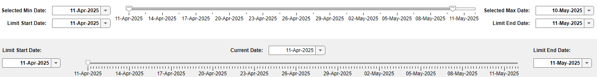

# Datetime Slider UI Components

## Custom Datetime Slider UI Components

This repository contains two custom UI components, `DatetimeSlider` and `DatetimeRangeSlider`, which provide intuitive and interactive ways to work with datetime arrays in your MATLAB&reg; applications.

## DatetimeSlider

The `DatetimeSlider` component comes with a single-thumb slider that allows users to select a specific datetime value from a predefined range and also date pickers to select the "current", "start", and "end" date. It provides a seamless way to navigate through datetime arrays and can be easily integrated into your MATLAB GUI applications.

### Features
- **Interactive Selection**: Users can slide to select a specific datetime value.
- **Customizable Range**: Define the start and end datetime values to suit your application needs.
- **Date Pickers**: Easily select the date range for the selection and for the slider itself using integrated date pickers.

## DatetimeRangeSlider

The `DatetimeRangeSlider` component extends the functionality of the `DatetimeSlider` by providing a dual-thumb slider for selecting a range of datetime values. This is particularly useful for applications that require users to define a start and end date/time range.

### Features
- **Dual-thumb Slider**: Allows for the selection of a datetime range with start and end points.
- **Customizable Range**: Define the overall datetime range and the initial selection range.
- **Date Pickers**: Easily select "current", "start", and "end" dates using integrated date pickers.

## Setup 

1. Open `DatetimeSlider.mlapp` or `DatetimeRangeSlider.mlapp` in App Designer.
2. Click "Configure for Apps" under the Designer tab.
3. Open or create a new app in App Designer.
4. Drag the custom UIComponent (`DatetimeSlider` or `DatetimeRangeSlider`) from the Component Library (left panel of App Designer when in Design View) under the "My Components (Custom)" section.
5. Add a callback to the custom UIComponent and utilize the built-in public functions (e.g., `getSliderThumb`) of the UIComponent.

### Description

The Datetime Slider UI components are sliders that use and display datetime arrays, providing an interactive way to select and navigate through dates and times in your MATLAB applications.

### MathWorks&reg; Products (http://www.mathworks.com)

Requires MATLAB release R2024a or newer

### System Requirements

[Operating System requirements](https://www.mathworks.com/support/requirements/previous-releases.html)

## Getting started

### Description

The Datetime Slider UI Components are sliders that use and display Datetime arrays.

### Example
Please see the following MATLAB app examples:
- DatetimeSlider_Example_App.mlapp
- DatetimeRangeSlider_Example_App.mlapp
- Advanced_Example_App.mlapp

## License

The license is available in the License file within this repository.
